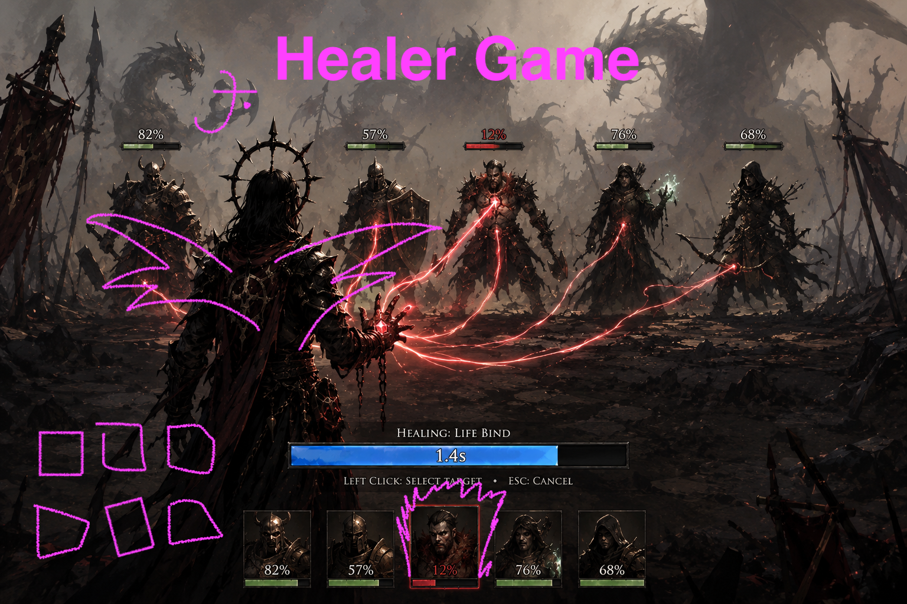

# healgame



Status: current · Authority: repo landing / vibe · Last verified: 2026-07-17

A healer-focused indie game inspired by *Master Healer Kale with useless party*, rebuilt around exclusive builds, readable casting, and old-school MMO healing — in a heavy-metal dark fantasy skin.

You keep a mercenary warband alive on a single battle line while you triage heals and mana. Between runs you spend talent points on trees that lock out other paths.

## Art / vibe (for concept art)

You are the only healer that matters: a grim warband stands on a single horizontal battle line facing monsters — nobody moves, steel and spells fire on cooldown, while you click targets and cast under a glowing cast bar like old-school MMO healing. The mood is heavy-metal dark fantasy (*The Last Spell* dread meets panel-van dragon swagger): ash, iron, blood-red rubies, mythic beasts, and last-stand grit — not cute, not comedy-useless. Visually, sell the silhouette of **healer in the backline keeping killers alive**, scarce crimson gems as power, and a world that looks loud, cursed, and cool enough to airbrush on a van.

## Status

**Playable Alpha** (through Oathbound Depth). Phaser 3 + TypeScript + Vite under [`game/`](game/):

```bash
cd game && npm install && npm run dev   # → http://localhost:5173
```

**Quality gate** (from `game/`): `npm run verify` — one script for local and CI;
passing stages print a single line, failures dump output. Full suite includes
journey (~5 min); `npm run verify:fast` skips journey. CI runs the full suite on
every push/PR ([`.github/workflows/verify.yml`](.github/workflows/verify.yml)).
Ship log: [docs/CHANGELOG.md](docs/CHANGELOG.md). Decisions + tuning:
[docs/poc-qa.md](docs/poc-qa.md).

Dungeon content is inspectable without launching the game:

```bash
npm run content -- validate
npm run content -- list
npm run content -- preview --all
```

## Docs

Doc conventions + authority: [`AGENTS.md`](AGENTS.md). Operating rules:
[`CLAUDE.md`](CLAUDE.md).

| Doc | Role |
|-----|------|
| [**Changelog**](docs/CHANGELOG.md) | What shipped (newest first) |
| [**PoC Spec**](docs/poc-spec.md) | PoC baseline (phase amendments win) |
| [PoC QA](docs/poc-qa.md) | Journey checklist, balance gates, tuning log |
| [Semantic targets](docs/semantic-targets.md) | Journey `setName` inventory |
| [Tree AGENTS](game/src/tree/AGENTS.md) | Config-driven skill-tree service |
| [Combat README](game/src/combat/README.md) | Engine API + rule decisions |
| [Dungeon content README](game/src/data/README.md) | Ability, mob, dungeon, validation, assembly, and preview contracts |
| [Unit art](docs/unit-art.md) | Kenney tile mapping |
| [Ideas](docs/ideas.md) | Uncommitted backlog |
| [GDD](docs/GDD.md) | Long-term design only |
| [Kale research](docs/research/master-healer-kale.md) | Inspiration |

## In one breath

Oathbound only · tutorial Bonk + Solemn Mend · expected wipe · XP levels + talent
tree · ruby oath in the spell tree (rival LOCKED, visible) · Ash Gate → Iron
Pass → mid dungeons → Black Choir → unwinnable Maw · major CDs + relics + QWER
loadout · single local save · restart only
