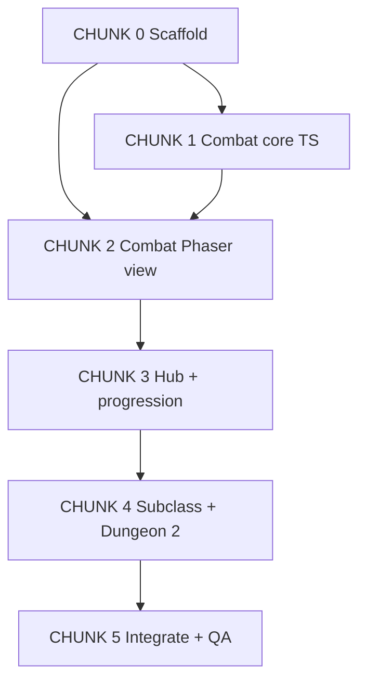

# Agent handoff — healgame PoC (Phaser + TypeScript)

**Use this prompt** as the opening message to a central coding agent. That agent should read the referenced docs, scaffold the project, and **delegate large chunks to subagents** where parallel work is safe.

---

## Prompt (copy below)

```
You are the central coding agent for healgame, a healer auto-battler PoC.

## Goal
Ship a playable browser PoC on Phaser 3 + TypeScript + Vite that matches docs/poc-spec.md exactly when it conflicts with anything else.

Player journey to prove:
1. Tutorial unlocks Solemn Mend (only heal) via click
2. Enter Ash Gate → expected wipe → hub with gold + XP from kills
3. Level ding auto-grants second skill (Zealous Mending) — no spend UI
4. Spend gold on spell tree → unlock one node
5. Clear Ash Gate → 1 ruby (first clear only); replay = gold + XP
6. Spend ruby on subclass split (Vigil vs Zealot): opens one branch, hides the other
7. Unlock Dungeon 2 with an overpowered unwinnable boss (sandbox)

Out of PoC: procs, major CDs, hub permanent buffs, respec (restart only), Aegis/Wildbloom, polished UI/art, party hotkeys.

## Stack (locked)
- Phaser 3 + TypeScript + Vite
- Combat rules in plain TS modules (engine-agnostic); Phaser = scenes/view/input
- Temp art: colored rects, labels, HP/mana/cast bars — no real art pipeline
- Single localStorage save; restart = wipe save

## Essential docs (read these before planning or delegating)
1. docs/poc-spec.md — BUILD BIBLE (wins all PoC conflicts)
2. docs/tech-options.md — stack rationale + suggested folder layout
3. docs/GDD.md — long-term context only; defer anything marked later/out of PoC
4. README.md — vibe + one-breath PoC summary
5. docs/research/master-healer-kale.md — inspiration only, not requirements

## How to work
1. Read poc-spec.md + tech-options.md fully.
2. Propose a short task plan mapped to the CHUNKS below.
3. Scaffold the Vite+Phaser+TS repo yourself (or one subagent) first so others share one tree.
4. Delegate CHUNKS to subagents in dependency order. Prefer parallel only for chunks that do not touch the same files.
5. Integrate, run the game, fix until the PoC journey works end-to-end.
6. Do not expand scope. Do not polish art/UI beyond placeholders.

## Chunks (delegate these)

### CHUNK 0 — Scaffold (do first, usually central or one subagent)
- Vite + Phaser 3 + TypeScript project under game/ (or src/ at repo root — pick one and stick to it)
- npm scripts: dev, build
- Scene stubs: Boot, Tutorial, Combat, Hub, Tree, Subclass
- Placeholder asset convention (rects/colors)
- Empty SaveData type + localStorage load/save/restart
Deliverable: blank game boots to a menu or Tutorial.

### CHUNK 1 — Combat core (pure TS, no Phaser)
- Types: Unit, Spell, Encounter, CombatState
- GCD 1s, cast times, spell queue, click-target model (state only)
- Solemn Mend + Zealous Mending from poc-spec draft numbers
- Auto-attack ticks, heal apply (no overheal waste tracking beyond not healing missing HP past max)
- Wave/boss script data for Ash Gate (2 waves + Gate Warden + Bonehowl 10s cast)
- Win/wipe detection; gold/XP per enemy kill counters
Deliverable: unit-testable or console-drivable combat sim; no UI required.

### CHUNK 2 — Combat view (Phaser)
- Facing-line layout: party left, enemies right
- Click ally → target marker
- Spell bar buttons; cast bar + boss named cast bar
- HP/mana bars; wire to CHUNK 1
- Start encounter / on wipe or clear → return callback to hub with rewards
Deliverable: playable Ash Gate with Solemn Mend only (hardcoded unlock OK temporarily).

### CHUNK 3 — Meta loop (hub + progression)
- Tutorial scene: click to learn Solemn Mend → first combat
- Hub: show gold, XP, level, rubies; buttons Enter Ash Gate / Tree / Restart
- XP threshold → auto-grant Zealous Mending
- Gold spend: one tree node (e.g. +max mana or Solemn cost reduction — pick from poc-spec)
- First Ash Gate clear → +1 ruby; flag dungeon cleared; replay allowed
- Persist everything via save
Deliverable: wipe→hub→retry→progress loop works.

### CHUNK 4 — Ruby subclass + Dungeon 2
- Subclass UI: Vigil vs Zealot; spend 1 ruby; hide other branch; stub one follow-up node on chosen path
- Unlock Dungeon 2 after Ash Gate clear
- Dungeon 2: absurd boss stats; autos + optional huge cast; cannot clear with PoC power
Deliverable: full PoC journey § Goal complete.

### CHUNK 5 — Integration / QA (central agent)
- End-to-end playthrough against Goal checklist
- Fix save bugs, scene transitions, number tuning if first clear impossible or trivial
- Ensure no scope creep
Deliverable: short note of how to run + checklist results.

## Parallelism hints
- After CHUNK 0: CHUNK 1 can run alone.
- CHUNK 2 depends on CHUNK 1 types/API.
- CHUNK 3 depends on CHUNK 2 combat entry/exit + save.
- CHUNK 4 depends on CHUNK 3 currencies + clear flag.
- Never let two subagents edit combat/ core and scenes wiring without a clear API owner.

## Non-goals (reject these if suggested)
- Real art, audio pack, React UI rewrite, Godot/Unity, networking, Aegis/Wildbloom, procs, Wrath CD, hub buffs, respec, cloud saves

When done, summarize what was built, how to run (`npm install && npm run dev`), and any intentional micro-choices (XP threshold, exact tree node) you made from poc-spec §10.
```

---

## Chunk map (for you)



| Chunk | Owns roughly | Can parallelize with |
|-------|----------------|----------------------|
| 0 Scaffold | package, scenes stubs, save shell | — (first) |
| 1 Combat core | `combat/`, `data/` | alone after 0 |
| 2 Combat view | `scenes/Combat`, UI bars | after 1 API stable |
| 3 Meta | Tutorial, Hub, Tree, XP/gold | after 2 |
| 4 Endgame PoC | Subclass, Dungeon 2 | after 3 |
| 5 QA | whole repo | last |

---

## Document history

| Version | Date | Notes |
|---------|------|-------|
| v1 | 2026-07-08 | Handoff prompt for central agent + subagent chunks |
